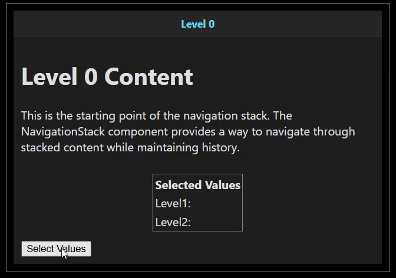

# Blazor Navigation Stack
[](https://www.nuget.org/packages/Blazor.NavigationStack)

A flexible navigation stack for Blazor. Manage complex navigation while retaining states, ideal for wizards, multi-step
forms, and nested workflows.

## Table of Contents
- [Samples/Demo](#samplesdemo)
- [Installation](#installation)
- [Basic Usage](#basic-usage)
	- [Obtaining INavigationStack](#obtaining-inavigationstack)
	- [Add a page to the stack](#add-a-page-to-the-stack)
	- [Add a page expecting a result](#add-a-page-expecting-a-result)
- [Preserving states](#preserving-states)
- [Interacting with a page on top of the stack](#interacting-with-a-page-on-top-of-the-stack)
- [Customization](#customization)
	- [Overall Layout](#overall-layout)
	- [Header](#header)
	- [Header Stack](#header-stack)
	- [Header Separator](#header-separator)
	- [Menu](#menu)
	- [Back Button](#back-button)


## Samples/Demo
<a href="https://purple-rock-0e47e3410.6.azurestaticapps.net/" target="_blank">Live Demo</a>
<table>
  <tr>
    <td align="center"><strong>Nested</strong></td>
    <td align="center"><strong>Customized</strong></td>
  </tr>
  <tr>
    <td></td>
    <td></td>
  </tr>
  <tr>
    <td align="center"><strong>Steps</strong></td>
    <td align="center"><strong>Preserve States</strong></td>
  </tr>
  <tr>
    <td></td>
    <td></td>
  </tr>
</table>


## Installation
Add the nuget package in your Blazor project
```
> dotnet add package Blazor.NavigationStack

OR

PM> Install-Package Blazor.NavigationStack
```
*Nuget package page can be found [here](https://www.nuget.org/packages/Blazor.NavigationStack).*
## Basic Usage
### Obtaining INavigationStack
All operations on the Blazor navigation stack can be done through `INavigationStack` interface.
`INavigationStack` interface can be obtained through many ways.
1. Through context
	``` razor
	<NavigationStack>  
	 <BaseContent>  
	 <button @onclick="()=>StartClicked(context)">Start</button>  
	 </BaseContent>  
	</NavigationStack>  
	  
	@code {  
	  private void StartClicked(INavigationStack stack) {  
	        //push pages to the navigation stack  
	  }  
	}
	```

2. Through cascading parameter
	
 	ComponentWithNavigationStack.razor
	``` razor
	<NavigationStack>  
	 <BaseContent>  
	 <StackPageComponent/>  
	 </BaseContent>  
	</NavigationStack>
	```
	StackPageComponent.razor
	``` razor
	@code {  
	  [CascadingParameter]  
	    public INavigationStack? NavigationStack { get; set; }  
	}
	```

3. Through @ref
	``` razor
	<NavigationStack @ref="_stack">  
	</NavigationStack>  
	  
	@code {  
	  private INavigationStack? _stack;  
	}
	```
### Add a page to the stack
+ Adding a page on top of the current  one by calling `INavigationStack.Push` method.
+ Remove the top most page by calling `INavigationStack.Pop` method
``` razor
void ReturnClicked() {  
    _stack.Pop();  
}  
RenderFragment Content() {  
    return @<div>  
  Content of the page  
  <button @onclick="ReturnClicked">Return</button>  
 </div>;  
}  
await _stack.Push(new StackPage() {  
    Content = Content(),  
});
```
### Add a page expecting a result
+ Adding a page on top of the current  one by calling `INavigationStack.Push<T>` method.
+ Setting a result and pop the cuurent page by calling `INavigationStack.SetResult` method.

ComponentWithStack.razor
``` razor
RenderFragment Content() {  
    return @<StackPageComponent/>;  
}  
NavigationStack.Result<string> result = await _stack.Push<string>(new StackPage() {  
    Content = Content(),  
});  
if(result.IsCanceled) return;  
string? valueFromStackPage = result.Value;
```
StackPageComponent.razor
``` razor
<div>  
 <input type="text" @bind="_value"/>  
 <button @onclick="OkClicked">Ok</button>  
</div>  
  
@code {  
  [CascadingParameter]  
    public INavigationStack? NavigationStack { get; set; }  
    private string _value = "";  
    private void OkClicked() {  
        NavigationStack?.SetResult(_value);  
    }  
}
```
## Preserving states
State of components can be preserved in the stack frame itself.
``` csharp
    private class Data {
        public required string Value1 { get; init; }
        public required string Value2 { get; init; }
    }

    private Data? _data;

    private async Task ShowTableBuilder(INavigationStack stack) {
        string? value1 = null;
        string? value2 = null;

        async Task SelectValue1() {
            value1 = await ShowSelectValue(stack);
        }
        async Task SelectValue2() {
            value2 = await ShowSelectValue(stack);
        }

        void OkClicked() {
            if (value1 == null || value2 == null) return;
            stack.SetResult(new Data() {
                Value1 = value1,
                Value2 = value2,
            });
        }

        RenderFragment Content() {
            return @<div>
                <p>Select two values by navigating to sub-pages.
                   The selected values will be preserved in the stack frame allow 
                   each value to be selected separately.</p>
                <table>
                    <tr>
                        <th colspan="3">Select values</th>
                    </tr>
                    <tr>
                        <td><strong>Value1</strong></td>
                        <td>@value1</td>
                        <td>
                            <button @onclick="SelectValue1">Select value</button>
                        </td>
                    </tr>
                    <tr>
                        <td><strong>Value2</strong></td>
                        <td>@value2</td>
                        <td>
                            <button @onclick="SelectValue2">Select value</button>
                        </td>
                    </tr>
                    <tr>
                        <td colspan="3">
                            <button disabled="@(value1 == null || value2 == null)" @onclick="OkClicked">Ok</button>
                        </td>
                    </tr>
                </table>
            </div>;
        }

        NavigationStack.Result<Data> result = await stack.Push<Data>(new StackPage() {
            Content = Content(),
            Name = "Table Builder"
        });
        _data = result.Value;

    }


    private async Task<string?> ShowSelectValue(INavigationStack stack) {
        string? result = null;

        void OkClicked() {
            stack.Pop();
        }

        RenderFragment Content() {
            return @<div>
                <p>Enter a value in the input field and click 'Ok' to return to the 'Table Builder'.</p>
                <input type="text" @bind="result"/>
                <button @onclick="OkClicked">Ok</button>
            </div>;
        }

        bool success = await stack.Push(new StackPage() {
            Content = Content(),
            Name = "Select Value",
        });
        if (!success) return null;

        return result;
    }
```
## Interacting with a page on top of the stack

+ Properties of the `StackPage` can be updated after it was push onto the stack by calling `INavigationStack.SetName` and `INavigationStack.SetMenu` methods.
+ Changes to the content of the current page can be updated by calling `INavigationStack.Refresh`. It will rerender the page similar to calling StateHasChanged on a component.
```csharp
// Change the name of the current page
NavigationStack?.SetName("Page Title");

// Set a custom menu to the curret page
NavigationStack?.SetMenu(CustomMenuFragment);

// Rerender the navigation stack including the current page
NavigationStack?.Refresh();
```

## Customization
You can customize virtually every part of the Navigation Stack, including:
- Overall layout
- Header stack appearance
- Individual header styling
- Header separators
- Menu appearance
- Back button


To customize the Navigation Stack, pass custom RenderFragments to the appropriate parameters of the NavigationStack component:

```cshtml
<NavigationStack 
    BaseName="Home"
    Layout="@CustomLayout"
    HeaderStack="@CustomHeaderStack"
    Header="@CustomHeader"
    HeaderSeparator="@CustomHeaderSeparator"
    Menu="@CustomMenu"
    Back="@CustomBack">
    <BaseContent>
        <!-- Your base content here -->
    </BaseContent>
</NavigationStack>
```
### Overall Layout
The layout controls the overall structure of the navigation stack:

```cshtml
private RenderFragment<NavigationStack.LayoutContext> CustomLayout => context => {
    return @<div class="dark-layout">
                <div class="dark-header">
                    <div class="header-left">
                        @context.BackButton
                        @context.HeaderStack
                    </div>
                    <div class="header-right">
                        @context.MenuStack
                    </div>
                </div>
                <div class="dark-content">
                    @context.Content
                </div>
            </div>;
};
```


The `LayoutContext` provides:
- `BackButton`: Back navigation button
- `HeaderStack`: Breadcrumbs/header navigation
- `MenuStack`: Menu for the current page
- `Content`: The main content area
### Header
Customize how navigation headers appear:

```cshtml
private RenderFragment<NavigationStack.HeaderContext> CustomHeader => context => {
    return @<div class="@(context.IsActive ? "header-active" : "header-inactive")">
        @context.Name
    </div>;
};
```


The `HeaderContext` provides:
- `Name`: Title of the page
- `IsActive`: Whether this is the currently active page

### Header Stack
Change how the entire breadcrumb/header navigation appears:

```cshtml
private RenderFragment<NavigationStack.HeaderStackContext> CustomHeaderStack => context => {
    return @<div class="header-stack">
               @{
                   RenderFragment header = context.Headers.First();
                   <div class="header-item">
                       @header
                   </div>
               }
           </div>;
};
```


The `HeaderStackContext` provides:
- `Headers`: Collection of header fragments to display
### Header Separator
Customize the separator between headers:

```cshtml
private RenderFragment CustomHeaderSeparator => @<div class="separator-arrow">
    <span>→</span>
</div>;
```

### Menu
Change how menu options are shown on each page:

```cshtml
private RenderFragment<NavigationStack.MenuContext> CustomMenu => context => {
    return @<div class="menu-container">
        @foreach (var option in context.Options) {
            <div class="menu-item">
                @option
            </div>
        }
    </div>;
};
```


The `MenuContext` provides:
- `Options`: Collection of menu item fragments to display

### Back Button
Change the appearance and behavior of the back button:

```cshtml
private RenderFragment<NavigationStack.BackContext> CustomBack => context => {
    return @<button class="back-button" @onclick="context.Back">
        <span>◀</span> Back
    </button>;
};
```


The `BackContext` provides:
- `Back`: Action to perform `INavigationStack.Cancel` 


For a complete example, see the `Blazor.NavigationStack.TestApp/Components/Pages/Customize.razor` component which demonstrates a dark-themed custom navigation stack.


